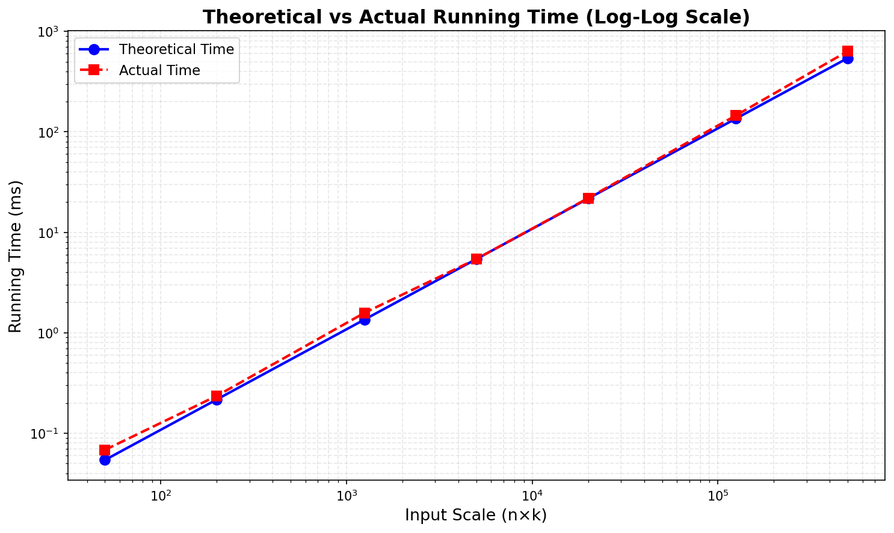

# Maximum Value But Limited Neighbors

## Problem Description

Given an array `a[1..n]` of positive numbers and an integer `k`, produce an array `b[1..n]` such that:

1. For each `j`, `b[j]` is 0 or 1
2. Array `b` has adjacent 1s at most `k` times
3. `sum_{j=1 to n} a[j] * b[j]` is maximized

### Examples

**Example 1:**
```
Input:  a = [100, 300, 400, 50], k = 1
Output: b = [0, 1, 1, 0]
Sum:    300 + 400 = 700
```

**Example 2:**
```
Input:  a = [10, 100, 300, 400, 50, 4500, 200, 30, 90], k = 2
Output: b = [1, 0, 1, 1, 0, 1, 1, 0, 1]
Sum:    10 + 300 + 400 + 4500 + 200 + 90 = 5500
```

### Adjacent Pairs Definition

The number of adjacent 1s is counted as consecutive pairs:
- `[0, 1, 0, 1, 0, 1, 1, 1]` has **2** adjacent pairs (one at positions 5-6, one at 6-7)
- `[0, 1, 0, 0, 1, 1, 1, 1]` has **3** adjacent pairs
- `[1, 0, 1, 1, 0, 1, 1, 1]` has **3** adjacent pairs

## Solution Approach

### Dynamic Programming

**State Definition:**
```
dp[i][j][last] = maximum sum considering first i elements,
                 with j adjacent pairs used,
                 last ∈ {0,1} indicates if element i is selected
```

**State Transitions:**

For each position `i`:

1. **Don't select `a[i-1]`:**
   ```
   dp[i][j][0] = max(dp[i-1][j][0], dp[i-1][j][1])
   ```

2. **Select `a[i-1]`:**
   - From `last=0`: `dp[i][j][1] = dp[i-1][j][0] + a[i-1]` (no adjacent pair)
   - From `last=1`: `dp[i][j][1] = dp[i-1][j-1][1] + a[i-1]` (creates adjacent pair)

**Complexity:**
- Time: O(n × k)
- Space: O(n × k)

## Usage

```python
from max_value_limited_neighbors import max_value_limited_neighbors

# Example usage
a = [100, 300, 400, 50]
k = 1
max_sum, b = max_value_limited_neighbors(a, k)

print(f"Selection: {b}")      # [0, 1, 1, 0]
print(f"Maximum sum: {max_sum}")  # 700
```

## Running Tests

```bash
# Run all unit tests
python -m unittest test_max_value_limited_neighbors -v

# Run the main file (includes examples + performance analysis)
python max_value_limited_neighbors.py
```

## Performance Analysis

The main file includes an empirical performance analysis that compares theoretical vs actual running times:

### Methodology

1. **Experimental Phase**: Run the algorithm on various input sizes and measure actual execution times
2. **Calibration Phase**: Select a middle-scale test case to fit the unit operation time constant `c`
3. **Theoretical Calculation**: Compute theoretical times using the formula `T(n,k) = c × n × k`
4. **Comparison**: Calculate error rates between theoretical predictions and experimental results

### Example Output

```
Step 1: Running experiments and collecting actual data...
n=10, k=5    → 0.0692ms
n=100, k=50  → 5.6476ms
n=1000, k=500 → 643.41ms

Step 2: Calibrating unit operation time constant c...
Calibration point: n=100, k=50, c = 1.1295 μs

Step 3: Calculating theoretical times and comparing...
n=100, k=50  → Theory=5.6476ms, Actual=5.6476ms, Error=0.00% *
n=1000, k=500 → Theory=564.76ms, Actual=643.41ms, Error=13.93%

Complexity Verification:
Scale grows 10000x → Time grows 9299x
✓ Confirms O(n×k) complexity
```

The calibration point (marked with `*`) has 0% error by design, while other points show how well the O(n×k) model fits the actual behavior.

### Visualization

The analysis generates a log-log plot comparing theoretical and actual running times:



The plot shows:
- **Blue line with circles**: Theoretical running time based on O(n×k) complexity
- **Red dashed line with squares**: Actual measured running time
- Both curves closely follow each other, confirming the O(n×k) time complexity

## Files

- `max_value_limited_neighbors.py` - Main algorithm implementation
- `test_max_value_limited_neighbors.py` - Comprehensive unit tests (22 test cases)
- `README.md` - Documentation

## Algorithm Features

- Guarantees global optimal solution
- Handles all edge cases (k=0, k>n, empty arrays)
- Efficient O(nk) time complexity
- Includes solution verification and backtracking
- Full test coverage with 22 unit tests
